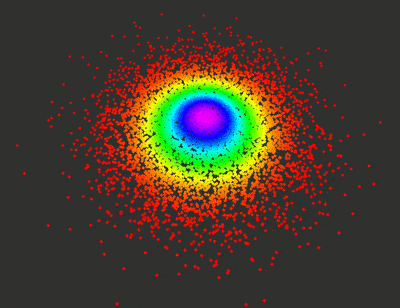

# ROS Bare Bones (with PCL)

The purpose of this repository is to build a framework for any PCL-ROS based project.



## Dependencies
- ROS
- C++ 14
- PCL 1.8
- Docker (Optional)

##  Quickstart Guide
To build your own project, you need to modify few of the files.
```html
 - apps/ros_backbones_nodelet.cpp
 - nodelet_plugins.xml
 - package.xml
 - launch/ros_back_bones.launch
 - CMakeLists.txt
```

In `package.xml`, change the following marked as XXXXXXXXXXX

```
<name>XXXXXXXXXXX</name>
    <version>0.0.0</version>
    <description>XXXXXXXXXXX</description>

    <maintainer email="XXXXXXXXXXX"> XXXXXXXXXXX</maintainer>
```

In `nodelet_plugins.xml`, change the following marked as XXXXXXXXXXX

```
<library path="lib/libxxxxxxxxxxxx">
    <class name="xxxxxxxxxxxx/XXXXXXXXXXX" type="xxxxxxxxxxxx::XXXXXXXXXXX"
           base_class_type="nodelet::Nodelet"/>
</library>
```

In `CMakeLists.txt`, change the following

```
project(sll_obstacle_detection)
add_library(xxxxxxxxxxxx apps/detection.cpp)
target_link_libraries(xxxxxxxxxxxx PUBLIC ${catkin_LIBRARIES} PUBLIC ${PCL_LIBRARIES})
```

## Build

The idea is to build ROS packages separately. This helps to build any ROS based projects faster. 
```
cd
mkdir ros_package && cd ros_package
mkdir catkin_ws && cd catkin_ws
mkdir src && cd src
git clone git@github.com:arghadeep25/ROS-Bare-Bones.git
cd ~/ros_packages/catkin_ws/
catkin_make
```

## Execution
Once build successfully, you can try the commands below.
```
roscore
roslaucnh rosbarebones ros_bare_bones.launch
```

## Docker 

If you want to run the Docker image, try pulling from this [Docker Hub](https://hub.docker.com/r/arghadeep25/rosbarebones/)

```
docker pull arghadeep25/rviz_docker:0.1
```

and run the Docker image

```
docker run --rm arghadeep25/rviz_docker:0.1
```

## FAQ
### [ERROR] 'catkin_make' not found
Follow this tutorial [ROS Answers](https://answers.ros.org/question/206876/how-often-do-i-need-to-source-setupbash/)
## Further Reading

[ROS Nodelet Tutorial](http://wiki.ros.org/nodelet/Tutorials/Porting%20nodes%20to%20nodelets)\
[Docker Manual](https://github.com/arghadeep25/Docker-Manual)
